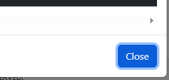

# Bug Report - Practice Form Functionality

## Default Test Data
For all bug reports unless specified otherwise:

| Field | Value |
|-------|-------|
| First Name | "Carlos" |
| Last Name | "Solorzano" |
| Gender | "Male" |
| Mobile | "1234567890" |
| Date of Birth | "12 Oct 2000" |

### BUG-01: First Name field has no character limit

| Field | Value |
|-------|-------|
| **Test Case** | TC-04: First Name - Character limit |
| **Description** | First Name field has no character limit, accepts very long text (51+ characters) without any error message or truncation |
| **Preconditions** | User navigated to https://demoqa.com/automation-practice-form   All other required fields filled with valid defaults |
| **Test Data** | First Name: 256 characters ("A" repeated 256 times) |
| **Steps** | 1. Enter valid data in all other required fields   2. Enter 51 characters in First Name field (type "A" 51 times)   3. Click Submit button |
| **Expected Result** | System should handle long input appropriately (error message, truncation, or limit warning) |
| **Actual Result** | Form submitted successfully   First Name field accepted very long text without any error or truncation. |
| **Environment** | Windows 10, Google Chrome |
| **Severity** | Low |
| **Priority** | Low |
| **Status** | Open |
| **Reported By** | Zahid Solorzano |
| **Evidence** |  |

### BUG-02: First Name field allows numeric characters

| Field | Value |
|-------|-------|
| **Test Case** | TC-05: First Name - Rejects numeric characters |
| **Description** | First Name field allows user to enter numeric characters without any error message |
| **Preconditions** | User navigated to https://demoqa.com/automation-practice-form   All other required fields filled with valid defaults |
| **Test Data** | First Name: "Carlos123" |
| **Steps** | 1. Enter valid data in all other required fields   2. Enter "Carlos123" in First Name field   3. Click Submit button |
| **Expected Result** | Form should not submit   First Name field should be highlighted with a red outline |
| **Actual Result** | Form submitted successfully   First Name field accepts numeric characters without error |
| **Environment** | Windows 10, Google Chrome |
| **Severity** | Low |
| **Priority** | Medium |
| **Status** | Open |
| **Reported By** | Zahid Solorzano |
| **Evidence** |  |

### BUG-03: First Name field allows special characters

| Field | Value |
|-------|-------|
| **Test Case** | TC-06: First Name - Reject special characters |
| **Description** | First Name field allows user to enter special characters without any error message (besides spaces, hyphens, dots and apostrophes) |
| **Preconditions** | User navigated to https://demoqa.com/automation-practice-form   All other required fields filled with valid defaults |
| **Test Data** | First Name: "Carlos@#$" |
| **Steps** | 1. Enter valid data in all other required fields   2. Enter "Carlos@#$" in First Name field   3. Click Submit button |
| **Expected Result** | Form should not submit   First Name field should be highlighted with a red outline |
| **Actual Result** | Form submitted successfully   First Name field accepts all special characters without error |
| **Environment** | Windows 10, Google Chrome |
| **Severity** | Low |
| **Priority** | Medium |
| **Status** | Open |
| **Reported By** | Zahid Solorzano |
| **Evidence** |  |

### BUG-04: Last Name field has no character limit

| Field | Value |
|-------|-------|
| **Test Case** | TC-07: Last Name - Character limit |
| **Description** | Last Name field has no character limit, accepts very long text (51+ characters) without any error message or truncation |
| **Preconditions** | User navigated to https://demoqa.com/automation-practice-form   All other required fields filled with valid defaults |
| **Test Data** | Last Name: 256 characters: "B" repeated 51 times |
| **Steps** | 1. Enter valid data in all other required fields   2. Enter 256 characters in Last Name field (type "B" 51 times)   3. Click Submit button |
| **Expected Result** | System should handle long input appropriately (error message, truncation, or limit warning) |
| **Actual Result** | Form submitted successfully   Last Name field accepted very long text without any error or truncation. |
| **Environment** | Windows 10, Google Chrome |
| **Severity** | Low |
| **Priority** | Low |
| **Status** | Open |
| **Reported By** | Zahid Solorzano |
| **Evidence** |  |

### BUG-05: Last Name field allows numeric characters

| Field | Value |
|-------|-------|
| **Test Case** | TC-08: Last Name - Rejects numeric characters |
| **Description** | Last Name field allows user to enter numeric characters without any error message |
| **Preconditions** | User navigated to https://demoqa.com/automation-practice-form   All other required fields filled with valid defaults |
| **Test Data** | Last Name: "Solorzano123" |
| **Steps** | 1. Enter valid data in all other required fields   2. Enter Last Name: "Solorzano123" in Last Name field   3. Click Submit button |
| **Expected Result** | Form should not submit   Last Name field should be highlighted with a red outline |
| **Actual Result** | Form submitted successfully   Last Name field accepts numeric characters without error |
| **Environment** | Windows 10, Google Chrome |
| **Severity** | Low |
| **Priority** | Medium |
| **Status** | Open |
| **Reported By** | Zahid Solorzano |
| **Evidence** |  |

### BUG-06: Last Name field allows special characters

| Field | Value |
|-------|-------|
| **Test Case** | TC-09: Last Name - Rejects special characters |
| **Description** | Last Name field allows user to enter special characters without any error message (besides spaces, hyphens, dots and apostrophes) |
| **Preconditions** | User navigated to https://demoqa.com/automation-practice-form   All other required fields filled with valid defaults |
| **Test Data** | Last Name: "Solorzano@#$" |
| **Steps** | 1. Enter valid data in all other required fields   2. Enter "Solorzano@#$" in Last Name field   3. Click Submit button |
| **Expected Result** | Form should not submit   Last Name field should be highlighted with a red outline |
| **Actual Result** | Form submitted successfully   Last Name field accepts all special characters without error |
| **Environment** | Windows 10, Google Chrome |
| **Severity** | Low |
| **Priority** | Medium |
| **Status** | Open |
| **Reported By** | Zahid Solorzano |
| **Evidence** |  |

### BUG-07: Email has no character limit in the local part

| Field | Value |
|-------|-------|
| **Test Case** | TC-10 Email - Character limit in the local part |
| **Description** | Email field in the local part (before the @) has no character limit, accepts very long text (65+ characters) without any error message or truncation |
| **Preconditions** | User navigated to https://demoqa.com/automation-practice-form   All required fields filled with valid defaults |
| **Test Data** | Email: (65 times "A") + "@example.com" |
| **Steps** | 1. Enter valid data in all other required fields   2. Enter 65 characters in Email fiel (type "A" 65 times before the @) then "example.com"   3. Click Submit button |
| **Expected Result** | System should handle long input appropriately (error message, truncation, or limit warning) |
| **Actual Result** | Form submitted successfully   Email field accepted very long text without any error or truncation in the local part |
| **Environment** | Windows 10, Google Chrome |
| **Severity** | Low |
| **Priority** | Medium |
| **Status** | Open |
| **Reported By** | Zahid Solorzano |
| **Evidence** |  |

### BUG-08: Email has no character limit in the domain part

| Field | Value |
|-------|-------|
| **Test Case** | TC-11 Email - Charcater limit in the domain part |
| **Description** | Email field  in the domain part (after the @ and before the last dot) has no character limit, accepts very long text (65+ characters) without any error message or truncation |
| **Preconditions** | User navigated to https://demoqa.com/automation-practice-form   All required fields filled with valid defaults |
| **Test Data** | Email:  + "carlostest@" + (65 times "A") + ".com" |
| **Steps** | 1. Enter valid data in all other required fields   2. Enter "carlostest@" + (type 65 times "A") + ".com" in the email field   3. Click Submit button |
| **Expected Result** | System should handle long input appropriately (error message, truncation, or limit warning) |
| **Actual Result** | Form submitted successfully   Email field accepted very long text without any error or truncation in the domain part |
| **Environment** | Windows 10, Google Chrome |
| **Severity** | Low |
| **Priority** | Medium |
| **Status** | Open |
| **Reported By** | Zahid Solorzano |
| **Evidence** |  |

### BUG-09: Date of birth field allows future dates

| Field | Value |
|-------|-------|
| **Test Case** | TC-23: Date of birth field rejects future dates |
| **Description** | Date of birth field allows future dates without any errors or warnings|
| **Preconditions** | User navigated to https://demoqa.com/automation-practice-form   All other required fields filled with valid defaults |
| **Test Data** | Date of birt: 05/24/2026 |
| **Steps** | 1. Enter valid data in all other required fields   2. Select "05/24/2026" in Date of birt field   3. Click Submit button |
| **Expected Result** |Date of birth field gets highlighted with a red outline and Form should not submit|
| **Actual Result** | Form submitted successfully   Date of birth field allows future dates|
| **Environment** | Windows 10, Google Chrome |
| **Severity** | High |
| **Priority** | High|
| **Status** | Open |
| **Reported By** | Zahid Solorzano |
| **Evidence** |  |

### BUG-10: Picture field can allow non image formats

| Field | Value |
|-------|-------|
| **Test Case** | ### TC-27: Picture field can only allow image formats |
| **Description** | Picture field can be used to upload files that are not images (like videos) |
| **Preconditions** | User navigated to https://demoqa.com/automation-practice-form   All required fields filled with valid defaults |
| **Test Data** |  Picture: example.mp4 |
| **Steps** | 1. Enter valid data in all other required fields   2. Upload example.mp4 in the picture field   3. Click Submit button |
| **Expected Result** |Picture field is highlighted with a red outline or shows a warning messag and form should not be submited |
| **Actual Result** | User is allowed to upload non image files in the picture field   Form submitted successfully|
| **Environment** | Windows 10, Google Chrome |
| **Severity** | High|
| **Priority** | Migh |
| **Status** | Open |
| **Reported By** | Zahid Solorzano |
| **Evidence** |  |

### BUG-11: Address field has no character limit 

| Field | Value |
|-------|-------|
| **Test Case** | TC-29: Address - Character limit  |
| **Description** | Address field has no character limit, accepts very long text (201+ characters) without any error message or truncation |
| **Preconditions** | User navigated to https://demoqa.com/automation-practice-form   All required fields filled with valid defaults |
| **Test Data** | Address: Type "C" 500 times |
| **Steps** | 1. Enter valid data in all required fields   2. Enter 201 characters in address field (type "C" 201 times)   3. Click Submit button |
| **Expected Result** | System should handle long input appropriately (error message, truncation, or limit warning) |
| **Actual Result** | Form submitted successfully   Address field accepted very long text without any error or truncation. |
| **Environment** | Windows 10, Google Chrome |
| **Severity** | Low |
| **Priority** | Low |
| **Status** | Open |
| **Reported By** | Zahid Solorzano |
| **Evidence** |  |

### BUG-12: Selected state does not show in the summary window

| Field | Value |
|-------|-------|
| **Test Case** | TC-30: User can select a State without selecting a city |
| **Description** | Since the City and State field are consider optional, the user should be able to select a state and ignore the city field, however when user does this , the selected state does not shows in the summary window|
| **Preconditions** | User navigated to https://demoqa.com/automation-practice-form   All required fields filled with valid defaults |
| **Test Data** | State: "NCR" |
| **Steps** | 1. Enter valid data in all other required fields   2. Select "NCR" in the State field   3. Leave the city field in blank   4. Click Submit button |
| **Expected Result** | Form submitted successfully   Selected state shows in the summary window |
| **Actual Result** |Form submitted successfully   Summary window does not show the selected state|
| **Environment** | Windows 10, Google Chrome |
| **Severity** | Medium |
| **Priority** | High |
| **Status** | Open |
| **Reported By** | Zahid Solorzano |
| **Evidence** |  |

### BUG-13:  Summary window cannot be closed with the "close" button

| Field | Value |
|-------|-------|
| **Test Case** | ### TC-31: Summary window can be closed |
| **Description** | Once the summary window appear it should be able to be closed by clicking the "Close" button, instead the "Close" button does nothing and Summary window can only get closed by clicking anywhere outside the window.|
| **Preconditions** | User navigated to https://demoqa.com/automation-practice-form  |
| **Test Data** | First Name: "Carlos"   Last Name: "Solorzano"   Gender: "Male"   Mobile: "1234567890"   Date of Birth: "12 Oct 2000" |
| **Steps** | 1. Enter First Name: "Carlos"   2. Enter Last Name: "Solorzano"   3. Select Gender: "Male"   4. Enter Mobile: "1234567890"   5. Enter Date of Birth: "12 Oct 2000"   6. Click Submit button   7. Click Close button |
| **Expected Result** | Form submitted successfully   Summary window can be closed by clicking the "Close" Button |
| **Actual Result** | Form submitted successfully   Summary window cannot get closed by cliking the "Close" Button   Summary window can only get closed by clicking anywhere outside the window.|
| **Environment** | Windows 10, Google Chrome |
| **Severity** | Medium |
| **Priority** | Medium |
| **Status** | Open |
| **Reported By** | Zahid Solorzano |
| **Evidence** |  |

