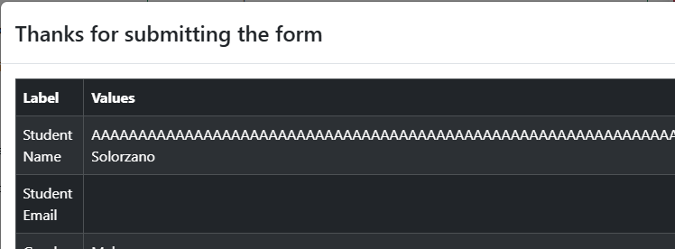

# Bug Report - Practice Form Functionality

## Default Test Data
For all bug reports unless specified otherwise:

| Field | Value |
|-------|-------|
| First Name | "Carlos" |
| Last Name | "Solorzano" |
| Gender | "Male" |
| Mobile | "1234567890" |
| Date of Birth | "12 Oct 2000" |

### BUG-01: First Name field has no character limit

| Field | Value |
|-------|-------|
| **Test Case** | TC-04: First Name - Character limit |
| **Description** | First Name field has no character limit, accepts very long text (256+ characters) without any error message or truncation |
| **Preconditions** | User navigated to https://demoqa.com/automation-practice-form   All other required fields filled with valid defaults |
| **Test Data** | First Name: 256 characters ("A" repeated 256 times) |
| **Steps** | 1. Enter valid data in all required fields   2. Enter 256 characters in First Name field   3. Click Submit button |
| **Expected Result** | System should handle long input appropriately (error message, truncation, or limit warning) |
| **Actual Result** | Form submitted successfully   First Name field accepted very long text without any error or truncation. |
| **Environment** | Windows 10, Google Chrome |
| **Severity** | Low |
| **Priority** | Low |
| **Status** | Open |
| **Reported By** | Zahid Solorzano |
| **Evidence** |  |

### BUG-02 First name field allows numeric characters

| Field | Value |
|-------|-------|
| **Test Case** | TC-05: First Name - Rejects numeric characters |
| **Description** | First Name field allows user to enter numeric characters without any error message |
| **Preconditions** | User navigated to https://demoqa.com/automation-practice-form   All other required fields filled with valid defaults |
| **Test Data** | First Name: "Carlos123" |
| **Steps** | 1. Enter valid data in all required fields   2. Enter "Carlos123" in First Name field   3. Click Submit button |
| **Expected Result** | Form should not submit   First name field is highlighted with a red outline |
| **Actual Result** |Form is submitted successfully   First name field allows numeric characters. |
| **Environment** | Windows 10, Google Chrome |
| **Severity** | Low |
| **Priority** | Low |
| **Status** | Open |
| **Reported By** | Zahid Solorzano |
| **Evidence** |  |
