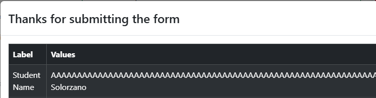
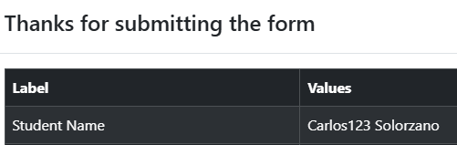
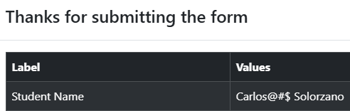
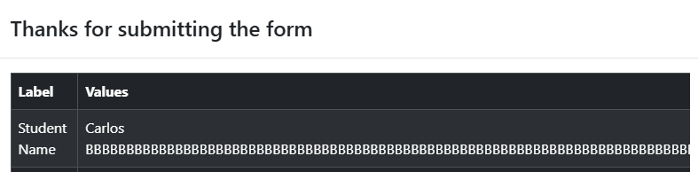
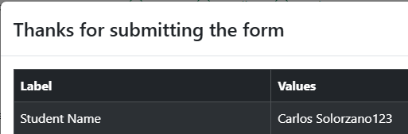

# Bug Report - Practice Form Functionality

## Default Test Data
For all bug reports unless specified otherwise:

| Field | Value |
|-------|-------|
| First Name | "Carlos" |
| Last Name | "Solorzano" |
| Gender | "Male" |
| Mobile | "1234567890" |
| Date of Birth | "12 Oct 2000" |

### BUG-01: First Name field has no character limit

| Field | Value |
|-------|-------|
| **Test Case** | TC-04: First Name - Character limit |
| **Description** | First Name field has no character limit, accepts very long text (256+ characters) without any error message or truncation |
| **Preconditions** | User navigated to https://demoqa.com/automation-practice-form   All other required fields filled with valid defaults |
| **Test Data** | First Name: 256 characters ("A" repeated 256 times) |
| **Steps** | 1. Enter valid data in all other required fields   2. Enter 256 characters in First Name field (type "A" 256 times)   3. Click Submit button |
| **Expected Result** | System should handle long input appropriately (error message, truncation, or limit warning) |
| **Actual Result** | Form submitted successfully   First Name field accepted very long text without any error or truncation. |
| **Environment** | Windows 10, Google Chrome |
| **Severity** | Low |
| **Priority** | Low |
| **Status** | Open |
| **Reported By** | Zahid Solorzano |
| **Evidence** |  |

### BUG-02: First Name field allows numeric characters

| Field | Value |
|-------|-------|
| **Test Case** | TC-05: First Name - Rejects numeric characters |
| **Description** | First Name field allows user to enter numeric characters without any error message |
| **Preconditions** | User navigated to https://demoqa.com/automation-practice-form   All other required fields filled with valid defaults |
| **Test Data** | First Name: "Carlos123" |
| **Steps** | 1. Enter valid data in all other required fields   2. Enter "Carlos123" in First Name field   3. Click Submit button |
| **Expected Result** | Form should not submit   First Name field should be highlighted with a red outline |
| **Actual Result** | Form submitted successfully   First Name field accepts numeric characters without error |
| **Environment** | Windows 10, Google Chrome |
| **Severity** | Low |
| **Priority** | Medium |
| **Status** | Open |
| **Reported By** | Zahid Solorzano |
| **Evidence** |  |

### BUG-03: First Name field allows special characters

| Field | Value |
|-------|-------|
| **Test Case** | TC-06: First Name - Reject special characters |
| **Description** | First Name field allows user to enter special characters without any error message (besides spaces, hyphens, dots and apostrophes) |
| **Preconditions** | User navigated to https://demoqa.com/automation-practice-form   All other required fields filled with valid defaults |
| **Test Data** | First Name: "Carlos@#$" |
| **Steps** | 1. Enter valid data in all other required fields   2. Enter "Carlos@#$" in First Name field   3. Click Submit button |
| **Expected Result** | Form should not submit   First Name field should be highlighted with a red outline |
| **Actual Result** | Form submitted successfully   First Name field accepts all special characters without error |
| **Environment** | Windows 10, Google Chrome |
| **Severity** | Low |
| **Priority** | Medium |
| **Status** | Open |
| **Reported By** | Zahid Solorzano |
| **Evidence** |  |

### BUG-04: Last Name field has no character limit

| Field | Value |
|-------|-------|
| **Test Case** | TC-07: Last Name - Character limit |
| **Description** | Last Name field has no character limit, accepts very long text (256+ characters) without any error message or truncation |
| **Preconditions** | User navigated to https://demoqa.com/automation-practice-form   All other required fields filled with valid defaults |
| **Test Data** | Last Name: 256 characters: "B" repeated 256 times |
| **Steps** | 1. Enter valid data in all other required fields   2. Enter 256 characters in Last Name field (type "B" 256 times)   3. Click Submit button |
| **Expected Result** | System should handle long input appropriately (error message, truncation, or limit warning) |
| **Actual Result** | Form submitted successfully   Last Name field accepted very long text without any error or truncation. |
| **Environment** | Windows 10, Google Chrome |
| **Severity** | Low |
| **Priority** | Low |
| **Status** | Open |
| **Reported By** | Zahid Solorzano |
| **Evidence** |  |

### BUG-05: Last Name field allows numeric characters

| Field | Value |
|-------|-------|
| **Test Case** | TC-08: Last Name - Rejects numeric characters |
| **Description** | Last Name field allows user to enter numeric characters without any error message |
| **Preconditions** | User navigated to https://demoqa.com/automation-practice-form   All other required fields filled with valid defaults |
| **Test Data** | Last Name: "Solorzano123" |
| **Steps** | 1. Enter valid data in all other required fields   2. Enter Last Name: "Solorzano123" in Last Name field   3. Click Submit button |
| **Expected Result** | Form should not submit   Last Name field should be highlighted with a red outline |
| **Actual Result** | Form submitted successfully   Last Name field accepts numeric characters without error |
| **Environment** | Windows 10, Google Chrome |
| **Severity** | Low |
| **Priority** | Medium |
| **Status** | Open |
| **Reported By** | Zahid Solorzano |
| **Evidence** |  |

### BUG-06: Last Name field allows special characters

| Field | Value |
|-------|-------|
| **Test Case** | TC-09: Last Name - Rejects special characters |
| **Description** | Last Name field allows user to enter special characters without any error message (besides spaces, hyphens, dots and apostrophes) |
| **Preconditions** | User navigated to https://demoqa.com/automation-practice-form   All other required fields filled with valid defaults |
| **Test Data** | Last Name: "Solorzano@#$" |
| **Steps** | 1. Enter valid data in all other required fields   2. Enter "Solorzano@#$" in Last Name field   3. Click Submit button |
| **Expected Result** | Form should not submit   Last Name field should be highlighted with a red outline |
| **Actual Result** | Form submitted successfully   Last Name field accepts all special characters without error |
| **Environment** | Windows 10, Google Chrome |
| **Severity** | Low |
| **Priority** | Medium |
| **Status** | Open |
| **Reported By** | Zahid Solorzano |
| **Evidence** |  |

### BUG-07: Email has no character limit in the local part

| Field | Value |
|-------|-------|
| **Test Case** | TC-10 Email - Character limit in the local part |
| **Description** | Email field in the local part (before the @) has no character limit, accepts very long text (65+ characters) without any error message or truncation |
| **Preconditions** | User navigated to https://demoqa.com/automation-practice-form   All required fields filled with valid defaults |
| **Test Data** | Email: (65 times "A") + "@example.com" |
| **Steps** | 1. Enter valid data in all other required fields   2. Enter 65 characters in Email fiel (type "A" 65 times before the @) then "example.com"   3. Click Submit button |
| **Expected Result** | System should handle long input appropriately (error message, truncation, or limit warning) |
| **Actual Result** | Form submitted successfully   Email field accepted very long text without any error or truncation in the local part |
| **Environment** | Windows 10, Google Chrome |
| **Severity** | Low |
| **Priority** | Medium |
| **Status** | Open |
| **Reported By** | Zahid Solorzano |
| **Evidence** |  |

### BUG-08: Email has no character limit in the domain part

| Field | Value |
|-------|-------|
| **Test Case** | TC-11 Email - Charcater limit in the domain part |
| **Description** | Email field  in the domain part (after the @ and before the last dot) has no character limit, accepts very long text (65+ characters) without any error message or truncation |
| **Preconditions** | User navigated to https://demoqa.com/automation-practice-form   All required fields filled with valid defaults |
| **Test Data** | Email:  + "carlostest@" + (65 times "A") + ".com" |
| **Steps** | 1. Enter valid data in all other required fields   2. Enter "carlostest@" + (type 65 times "A") + ".com" in the email field   3. Click Submit button |
| **Expected Result** | System should handle long input appropriately (error message, truncation, or limit warning) |
| **Actual Result** | Form submitted successfully   Email field accepted very long text without any error or truncation in the domain part |
| **Environment** | Windows 10, Google Chrome |
| **Severity** | Low |
| **Priority** | Medium |
| **Status** | Open |
| **Reported By** | Zahid Solorzano |
| **Evidence** |  |

